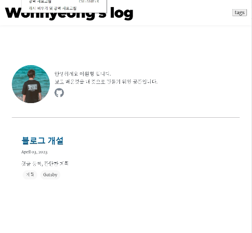

## Fontawesome 아이콘 크기 버그

local에선 문제가 없었지만 배포를 하고나니 `fontawesome`에서 가져와서 쓴 깃허브 아이콘이 크기가 커졌다 리사이징되는 버그가 있었습니다.

<br>
해당이슈 -> <https://github.com/WonhyeongLee/Wonhyeong.develop.log/issues/1>

CSS최적화 부분으로 삽질하다가 키워드를 정확히 검색했더니 해결법을 올려주신 분이 있어서 참고했습니다.<br>
<https://heyjihye.com/blog/gatsby-fontawesome-fix-huge-icons/>

develop모드에서 실행할 땐 SSR, SSG로 실행되지 않기 때문에 문제가 없었지만<br>
SSR, SSG에선(production모드) 첫 로딩 때 `fontawesome` 아이콘이 `SVG`요소로 변환돼서 요소로 포함되기 때문에 `fontawesome` 라이브러리 내부의 크기 설정부분이 적용되지 않은 아이콘이 보였다가 스타일이 나중에<br> 추가되면서 크기가 변경되는 현상 이었습니다. <br>움짤에서 보다시피 엄청 흉해서 반드시 해결해야 했습니다.

해결하는 방법은 `gatsby-browser.js`에서 빌드시점에서 페이지가 렌더링될 때 `fontawesome`스타일이 `head`에 추가되도록 더해주고 클라이언트에서 웹사이트가 초기화 될 때 스타일이 head에 추가되지 않도록 설정해주면 됩니다.

```js
// 빌드할 때 스타일 추가
import '@fortawesome/fontawesome-svg-core/styles.css';
// 클라이언트에서 초기화 될 때 스타일 추가되지 않도록 설정
import { config } from '@fortawesome/fontawesome-svg-core';
config.autoAddCss = false;
```

해결 방법으로 gatsby-plugin-fontawesome-css 플러그인도 있었는데<br>
위 해결방법이 공식문서에 올라가 있고 블로그를 직접 개발하려는 계기 중 하나가 Gatsby5 버전에서 진행하는거였고 해당 플러그인은 2년전부터 업데이트 되지 않은 플러그인이라 의존성문제가 발생해서 적용하지 않았습니다. 그리고 무엇보다 훨씬 복잡하게 해결하고 있다고 합니다.<br>
<https://fontawesome.com/v6/docs/web/use-with/react/use-with#next-js>

## 배운점

1. Fontawesome의 스타일 적용방식
2. 항상 공식문서를 확인하자
