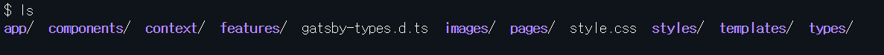
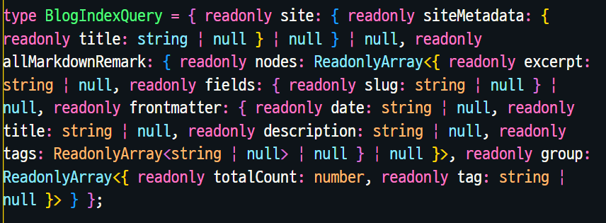

## 개요

블로그를 처음 만들 때부터 TS로 시작하면 편했을 텐데 JS로 진행해버렸고 컴포넌트들이 늘어나다보니 타이밍을 놓쳐버렸습니다. 그래서 이번에 redux toolkit을 적용하면서 작업 한 후기를 적어보려고 합니다.

## 타입스크립트 관련 패키지 설치 및 설정파일 수정

먼저 Typescript를 설치하고 설치한 라이브러리들의 타입관련 패키지를 설치했습니다.

이에 맞춰서 기존 babel, eslint의 설정을 타입스크립트 패키지에 맞춰 수정 해줬습니다.

> [eslintrc 설정](https://github.com/WonhyeongLee/Wonhyeong.develop.log/blob/master/.eslintrc)

대표적으로 `@babel/eslint-parser` 에서 `@typscript-eslint/parser`로 변경해주고 규칙들에 @typescript 규칙을 추가해줬습니다.

> [babelrc 설정](https://github.com/WonhyeongLee/Wonhyeong.develop.log/blob/master/.babelrc)

```json
{
  "presets": [
    ["@babel/preset-react", { "runtime": "automatic", "importSource": "@emotion/react" }]
  ],
  "plugins": ["@emotion/babel-plugin"]
}
```

emotion을 사용하고 있기 때문에 babel 설정을 추가로 해줬습니다.

> [tsconfig 설정](https://github.com/WonhyeongLee/Wonhyeong.develop.log/blob/master/tsconfig.json)

emotion을 사용하고 있기 때문에 `jsx`옵션에 `react-jsx`로 설정하고 `jsxImportSource`규칙에 `@emotion/react`로 설정했습니다.

이 규칙은 Typescript에서 emotion의 jsx runtime을 인식 할 수 있도록 설정해서 Emotion의 css prop을 사용할수 있게 해줍니다.

babelrc의 `@babel/preset-react`의 `runtime`옵션을 `automatic`으로 설정한 이유 입니다.

## Gatsby 파일 타입설정

[공식문서 링크](https://www.gatsbyjs.com/docs/how-to/custom-configuration/typescript/)

공식문서를 참고해서 `gatsby-browser`, `gatsby-config`, `gatsby-node`, `gatsby-ssr`파일을 수정해줬습니다.

## 컴포넌트들 변환 및 쿼리 타입 설정

js파일들을 tsx, ts 파일로 변환하고 쿼리에 대한 타입 선언을 해줬습니다.

```js
type BioQueryResult = {
  site: {
    siteMetadata: {
      author: {
        name: string,
        summary: string
      },
      social: {
        email: string,
        github: string
      },
      description: string
    }
  }
};
```

원래 이런식으로 타입을 선언해줘야 하지만

기존에 플러그인 이었다가 `gatsby@4.15.0` 부터 공식 지원하는 `typeGen`을 사용했습니다.

[graphql-typegen 공식문서](https://www.gatsbyjs.com/docs/how-to/local-development/graphql-typegen/)

typeGen을 사용하면 빌드 성공 시 ./src의 `gatsby-types.d.ts` 안에 해당 쿼리의 타이빙 자동으로 생성됩니다.

사용 조건으로 query의 이름을 컴포넌트 이름과 같도록 설정해줘야하고
빌드과정에서 오류가 나면 타입이 생성되지 않습니다.

이 부분에서 기존 존재하는 코드를 빌드가 되도록 먼저 변환했어야 했는데 왜 타입이 자동으로 생성되지 않는지 다른 방향으로 고민하느라 삽질을 했었습니다. 빌드 오류가 발생하면 타입이 생성되지 않습니다.

```js
import { Link, graphql, PageProps } from 'gatsby';
```

`PageProps`는 Gatsby가 페이지 컴포넌트에 전달하는 모든 `props`를 나타냅니다.

[공식문서 gatsby 타입정의](https://github.com/gatsbyjs/gatsby/blob/master/packages/gatsby/index.d.ts)

```js
const BlogIndex = ({ data, location }: PageProps<Queries.BlogIndexQuery>);
```

위와 같이 `PageProps<Queries.BlopgIndexQuery>`로 작성해주면서 자동생성된 `BlogIndexQuery`를 사용해 타입선언을 해줄 수 있습니다.

여기서 `Queries`는 네임스페이스로 자동생성된 `gatsby-types.d.ts`에 정의되어 있습니다.



아래와 같이 쿼리에 컴포넌트와 같은 이름을 적어주고 사용할 땐 BlogIndexQuery로 사용하면 됩니다.

```js
export const pageQuery = graphql`
  query BlogIndex {
    site {
      siteMetadata {
        title
      }
    }
    allMarkdownRemark(sort: { frontmatter: { date: DESC } }, limit: 1000) {
      nodes {
        excerpt
        fields {
          slug
        }
        frontmatter {
          date(formatString: "MMMM DD, YYYY")
          title
          description
          tags
        }
      }
      group(field: { frontmatter: { tags: SELECT } }) {
        tag: fieldValue
        totalCount
      }
    }
  }
`;
```

공식문서에는 쿼리명을 BlogIndex로 작성하고 사용할 때도 BlogIndex로 사용하는데 제 경우엔 BlogIndexQuery로 자동생성 되어있었습니다.



## 해결해야 하는 문제

1. Gatsby-browser.tsx 파일 에서 React를 import 해야하는 eslint와 tsconfig 설정이 충돌하는 문제가 있습니다.

```js
// eslint-disable-next-line no-unused-vars, @typescript-eslint/no-unused-vars
import * as React from 'react';
```

React 17부터 해당 문법을 사용하지 않아도 되고 tsconfig와 eslint 에서 해당 부분에 대해 오류가 나지 않게 설정했는데 `Gatsby-browser.tsx` 파일에서만 오류가 나서 해결하려고 설정을 처음부터 다시 해보는 등 시도 해봤으나 해결하지 못했고 규칙 예외처리를 해둔 상태입니다.

다시 설정을 살펴가면서 해결해 볼 예정입니다.

2. 컴포넌트에서 typeGen사용, 정리

오류없이 빌드하는 것을 목표로 변환하다보니 type, interface 사용에 통일성이 없고 컴포넌트에선 typeGen을 사용하지 않고 선언해서 사용한 부분을 수정할 예정입니다.
