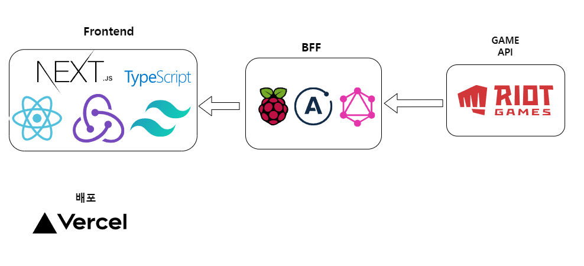
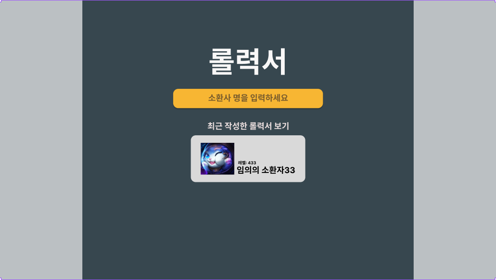
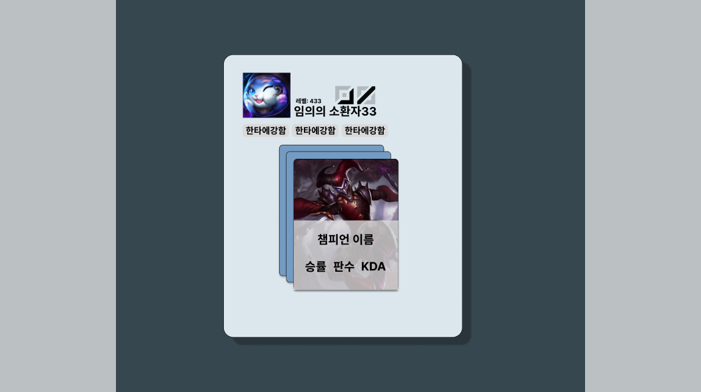
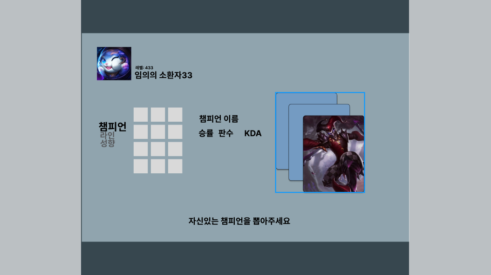
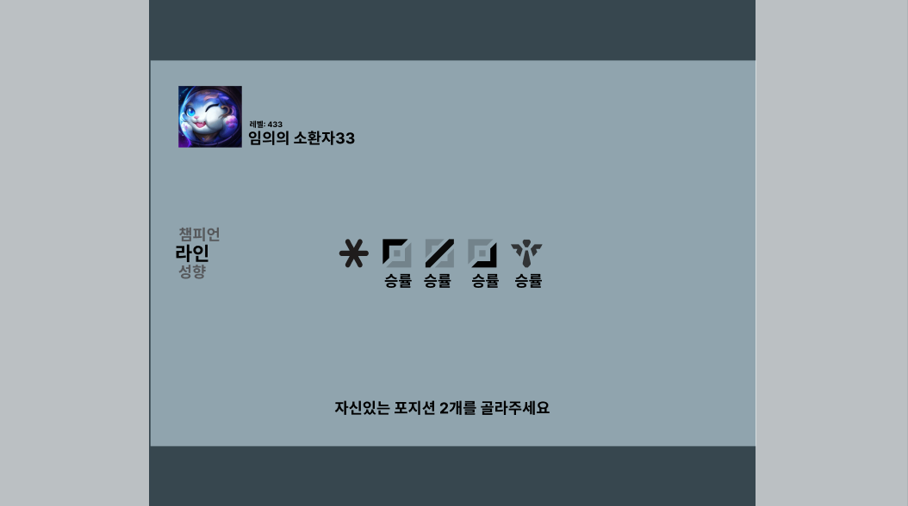
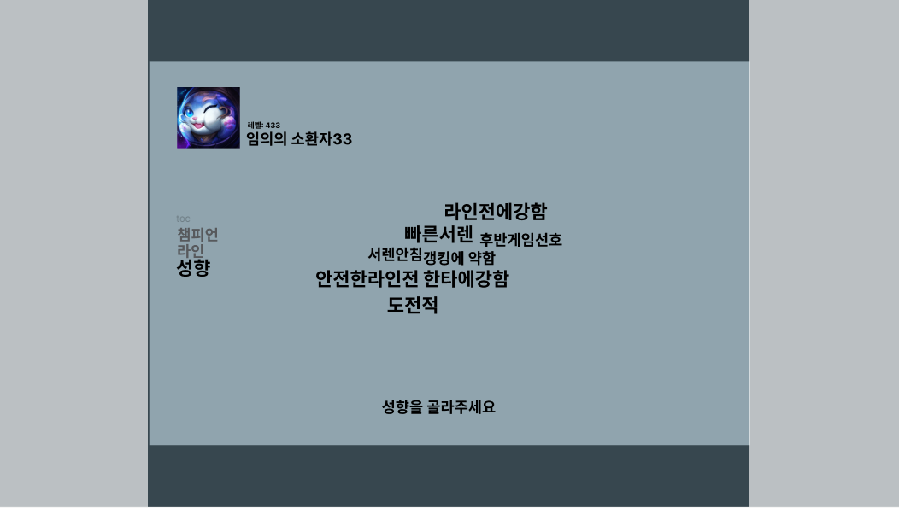

## 개요

이력서도 많이 떨어지고 검토해 보니 국비 지원 프로젝트, 원티드 기업과제 말곤 혼자 계획하고 배포까지 해본 이력이 없어서 요즘 관심이 많고 학습한 기술들을 사용해서 개인프로젝트를 진행해야겠다고 생각했고 쇼핑몰, 키오스크 같은 사이트도 생각했지만 제가 좋아하는 취미에 관련된 사이드 프로젝트를 진행하는 게 좋을 거 같아서 진행해 봤습니다.

## 프로젝트 설명 및 목표

게임 '리그오브레전드' 내에서 본인이 플레이한 주력 챔피언(모스트)을 카드 형태로 만들어서 보여주고 친구나 타인과 공유할 수 있는 사이트입니다.

목표로 하는 핵심 기능은 다음과 같습니다.

### 챔피언 명함 제공 & 공유

사용자는 자신 또는 타인의 닉네임을 검색할 수 있으며, 검색 결과로 솔로 랭크와 자유 랭크에서 가장 많이 플레이한 5개 챔피언을 카드 형식으로 확인할 수 있습니다. 각 카드를 클릭하면 해당 챔피언의 최근 30게임 전적과 승률이 표시됩니다. 또한, 이 카드를 친구나 게임 내 매칭된 유저들과 공유할 수 있습니다.

카드 애니매이션을 통해서 프로필을 독특하게 부각하고자 합니다.

### 해당 챔피언의 아이템 세트 제공

롤에서는 사용자가 아이템 빌드를 커스텀할 수 있는 '아이템 세트' 기능을 제공합니다. 하지만 초보자들은 이 기능의 존재조차 모르는 경우가 많습니다. 게임안에서 추천 아이템 선택지를 제공하나, 10년 넘게 즐기고 있는 유저로써 초보자들에게는 이 중에서 선택하는 것이 어렵다고 생각합니다.

물론 룬이나 아이템 세트를 자동으로 고티어 유저 셋팅을 불러와 설정해주는 데스크탑 앱들이 있지만 설치와 설정이 필요하기 때문에 친구들과 흥미로 챔피언 카드들을 전달하면서 해당 챔피언의 장인이 사용하는 아이템 빌드를 복사할 수 있게 제공하면 초보 유저들이나 이 기능을 모르는 유저들이 접근성 측면에서 사용하기 편하지 않을까 하는 생각에서 개발하려고 합니다.

## 사용하려는 기술 스택

프로젝트는 `NEXT.js` 프레임워크를 사용하여 `React`, `Redux toolkit`, `TypeScript`를 활용해 진행할 예정입니다.

스타일링은 `TailwindCSS`를 사용하며, 이 중에서 `twin.macro`를 활용해 `emotion`과 함께 사용할 계획입니다. 또 `TailwindCSS`를 보완하는 여러 라이브러리를 상황에 따라 사용할 예정입니다.

최근 BFF와 특히 graphQL을 사용하는 부분에 흥미가 있어서 프로젝트에 적용해보려고 합니다.

나름의 이유가 있는데 프로젝트에서 사용하려고 하는 라이엇의 API는 REST API 형태로 제공되기 때문입니다.

예를 들어 특정 소환자의 특정 매치를 검색하려면 `GET /lol/summoner/v4/summoners/by-name/{summonerName}`를 조회해 고유 ID와 계정 ID를 찾고
`GET /lol/match/v4/matchlists/by-account/{encryptedAccountId}`에서 앞에서 찾은 ID로 해당 소환사의 매치 리스트와 매치ID를 얻습니다.
`GET /lol/match/v4/matches/{matchId}` 이제 매치 ID를 사용해 해당 매치의 세부 내용을 찾을 수 있게 됩니다.

특정 소환사의 특정 매치를 검색하려면 여러 API 엔드포인트를 순차적으로 호출하고 결과를 조합해야 하는데, 이런 부분을 graphQL을 사용해 필요한 데이터만 제공할 수 있도록 조합하는 로직을 배치함으로써 해결할 수 있다고 생각했습니다.

BFF서버는 `Raspberry pi4`를 사용해 배포할 예정입니다.
학부 때`MQTT`서버와`Node-RED` 도구를 배포해본경험이 있고 기기가 남아있어 결정했습니다.

프론트 배포는 `NEXT.js`를 사용하니 `Vercel`로 배포 할 예정입니다.

## 예상 사이트 화면과 동작

사이트 메인 화면으로 프로필을 생성할 소환자명을 입력합니다.
아래에는 최근에 생성한 롤력서를 보여줍니다.

완성 프로필로 카드에 마우스를 올리면 챔피언 이름과 승률, 판수, KDA를 보여줍니다. 다른 카드들을 누르면 다른 챔피언 카드로 바뀌는 애니매이션을 줄 예정입니다.

프로필 설정에 3가지 과정을 제공하는데 먼저 가져온 데이터에서 플레이 한 챔피언의 초상화를 왼쪽에 나열하고 프로필로 설정 할 3개의 챔피언을 선택합니다.

자신있는 라인 2가지를 선택하는 라인 선택 과정입니다.

자신의 성향을 나열된 키워드를 선택해서 설정합니다.

프로필 설정 3가지 과정은 페이지를 이동하지 않고 슬라이드 형식으로 제공하도록 구현 예정입니다.

---

[카카오엔터프라이즈 FE 개발자 블로그: 카카오페이지 BFF](https://fe-developers.kakaoent.com/2022/220310-kakaopage-bff/)

[카카오페이 기술 블로그: BFF와 WebFlux 코루틴](https://tech.kakaopay.com/post/bff_webflux_coroutine/)

[YouTube: Apollo Client](https://www.youtube.com/watch?v=9G2vT4C4sAY&t=791s)

[YouTube: GraphQL Tools](https://youtu.be/HcVCb36WZZk)

BFF 공부에 도움이 된 블로그와 유튜브 링크입니다.
