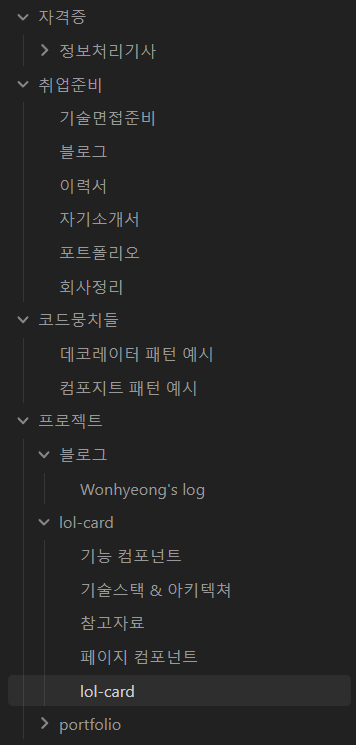
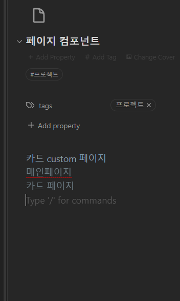
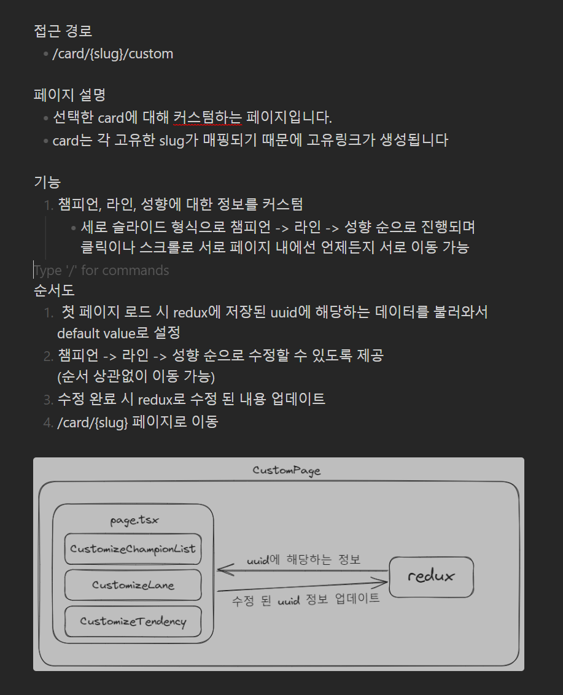

## 개요

페이지나 컴포넌트를 구현할 때 종종 체계가 부족해 시간이 오래 걸린다고 느꼈습니다.  
이에 따라 필수 기능과 동작을 미리 계획할 필요성을 인식했습니다. 두 가지 툴을 활용하여 구현 전에 계획을 세우고, 그 계획을 지속적으로 개선하면서 프로젝트를 완성할 예정입니다.

## 활용한 내용

### Obsidian

Notion은 예전부터 기술면접 스터디, 강의, 프로젝트 발표 등 여러 사람과 협업할 때 유용하게 사용했습니다. 
Obsidian은 좀 더 노트에 특화된 프로그램으로 생각하거나 조사한 내용을 바로바로 기록하고 키워드끼리 연관해 엮어주는게 마음에 들었습니다.
추가적으로 로컬 기반이라 Notion보다 가볍다는 점도 좋았습니다.
 그래서 Obsidian을 기반으로 사용하면서 협업을 할 경우 노션을 병행하자고 결론을 내렸고 Obsidian을 사용하기 시작했습니다.

프로젝트같은 경우에 Readme를 작성하기 쉽게 섹터를 나눠서 작성중입니다.

페이지 컴포넌트 사용예를 보면 `접근경로`, `설명`, `필수기능`, `예상 흐름` 같이 구체적으로 작성해서 계획적으로 구현할 수 있게 작성하고 있습니다.

Obsidian이 기능을 모듈식으로 제공하는데 많은 플러그인들이 존재합니다. 
그 중에 요즘 시퀀스 다이어그램이나 아키텍쳐 구조를 그리는데 자주 사용하는 Excalidraw도 플러그인으로 제공하고 있어서 추가로 설치해서 활용하고 있습니다.

## 마침

결론적으로 Obsidian의 모듈식 기능 & 다양한 플러그인을 활용해 다양한 계획과 프로젝트 구현을 체계적으로 할 수 있도록 많이 사용해보고 있습니다. 프로젝트를 설명하는데 시각화 하는게 전달력이 강하다고 생각해 서 해당 부분을 잘 쓰도록 노력하고 있습니다.
